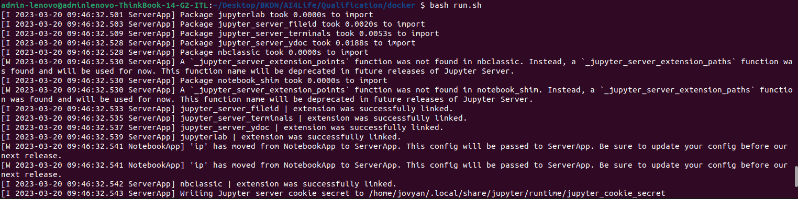
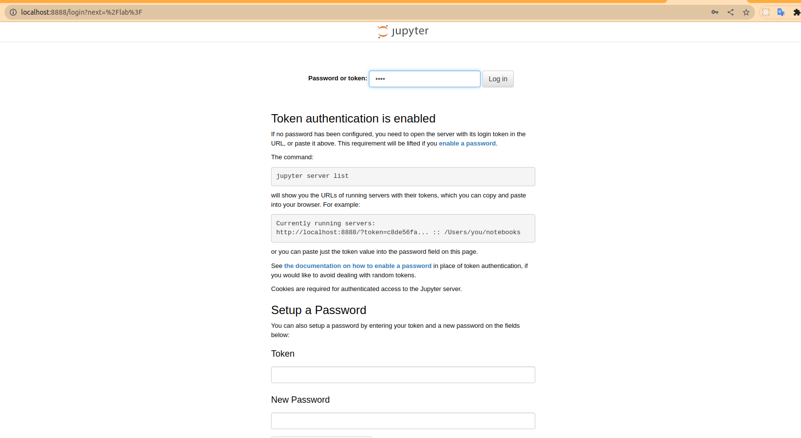
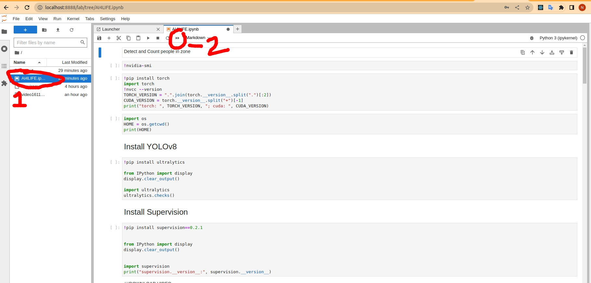

# AI4LIFE - Qualification Round
This readme will guide you how to run this code project

### Step 1: Install Docker
Based on your OS, pick the suitable tutorials below and install Docker
- Linux: https://docs.docker.com/engine/install/ubuntu/
- Windows: https://docs.docker.com/desktop/install/windows-install/

### Step 2: Building a container to run our app
Run the following command in your terminal
```
docker build -t all_newbie_ai4life/round1 .
```

This will build a container using descriptions in `Dockerfile` and install what's necessary to run our project. For further information, please check out the content of `Dockerfile`.

If you are on Linux system, just running `bash build.sh` is enough.


### Step 3: Start up container
Run the following command to start up your Jupyter notebook server that allows us to inspect Jupyter notebooks.
```
docker run --rm --name all_newbie_round_1 \
	-e JUPYTER_TOKEN=1234 \
	-p 8888:8888 \
	-v ./output/:/home/jovyan/notebooks/output all_newbie_ai4life/round1
```

If you are on Linux system, just running `bash run.sh` is enough.

Your terminal should output logs of the server:


### Step 4: Open Jupyter notebook in browser
- Open your browser and access `localhost:8888`, you will see the Jupyter welcome screen.



- Input password = `1234` then hit `OK`.
- Select our source code and hit run (If it asks, click **RESTART**)



- Read output at the bottom and wait for it to finish running
- It takes about 2-3 min with our default video and if you don't have GPU.

### Step 5: Result
- Checkout `/output` folder, it should finish rendering our video and name it `output.mp4`.
- To run with another video, replace the video in `./notebook/input.mp4` with another video, keeping the same name and do from Step 2 - Step 5 again.
